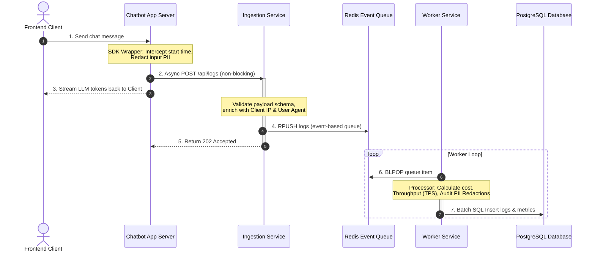

# Architecture Notes - LLM Inference Logging & Ingestion System

This document explains the core architectural patterns, logging flows, scaling mechanisms, and failure handling strategies designed for the Antigravity Inference Logging system.

---

## 1. Ingestion Flow

The log ingestion pipeline is structured as an asynchronous decoupled architecture to isolate user-facing chatbot request latencies from downstream database write operations.

### Flow Breakdown:
1. **Request Interception**: The client initiates a chat query. The Chatbot Backend calls the SDK wrapper, initiating latency tracking and sanitizing PII from the input prompt.
2. **Asynchronous Dispatch**: The SDK dispatches the log event asynchronously to the Ingestion Service API while the LLM begins returning token chunks. The UI is unaffected by logging network delays.
3. **Validation and Queueing**: The Ingestion Service validates the incoming request payload structure, enriches it with network metadata (IP, User-Agent), and pushes the raw log onto the Redis queue (`llm-logs-queue`) using `RPUSH`. An immediate `202 Accepted` response is returned.
4. **Queue Processing**: The worker process blocks on `BLPOP` against the Redis queue. When a log is received, it extracts costs (applying pricing structures per model) and throughput metrics, then inserts records into PostgreSQL.

---

## 2. Logging Strategy

- **Dual-Write Safety**: If the central Ingestion service or Redis is down, the SDK logger falls back to saving log metrics directly to a local cache/database. This ensures zero data loss during network splits.
- **PII Redaction**: Performed *at the edge* (within the SDK wrapper) before the log hits the network or is queued. This guarantees that unredacted raw credentials, emails, or credit card numbers never leave the application pod.
- **Estimated vs Exact Tokens**: In cases where underlying foundation models do not expose prompt/completion token metadata (such as streaming endpoints), the SDK calculates word counts and applies a $1.33$ multiplier to estimate token consumption.

---

## 3. Scaling Considerations

### Ingestion Service (Stateless)
- The Ingestion API is purely stateless. In production (and Kubernetes manifests), it runs with multiple replicas behind a load balancer. It handles tens of thousands of requests per second because its only task is schema validation and enqueuing logs to Redis.

### Redis Queue (Event-Based Buffer)
- Redis serves as a high-throughput event buffer, flattening spikes in traffic. If the database experiences a lock or performance slowdown, the Redis queue acts as a pressure valve, safely holding incoming logs until the workers drain them.

### Worker Service & Database
- The worker service can scale horizontally by running multiple consumer containers. Since Redis lists support safe atomic popping, multiple workers will compete for jobs on the queue without collisions.
- **Database Partitioning**: For long-term production, the `inference_logs` and `extracted_metadata` tables should be partitioned (e.g., weekly or monthly) on `request_timestamp` to prevent index bloat.

---

## 4. Failure Handling Assumptions

- **Ingestion Offline**: If the ingestion endpoint is unreachable or returns a `503`, the SDK prints the log to stderr and writes it to a local backup sqlite/memory table.
- **Redis Node Failure**: The ingestion service returns `500` if Redis is down, causing the SDK to fallback to direct local database writes.
- **Worker Crashes**: If a worker pod crashes mid-execution, Kubernetes automatically restarts it. Because logs are only popped when processing is ready, messages are safely buffered in Redis.
- **Poison Pill Messages**: If a log payload is corrupted and causes consistent processing errors in the worker, the worker catches the error, logs it to a dead-letter-queue (DLQ) file, and continues processing the next item, avoiding pipeline blockages.
